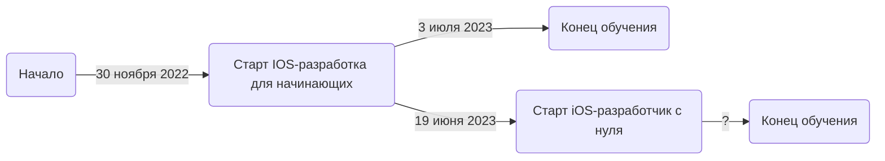

# Hello, world i'm Ilia
Привет мир, меня зовут Илья. Я начинающий iOS разработчик.

Swift - не первый мой язык, еще в институте я писал на Perl и Python.
На данный момент я закончил курсы **IOS-разработка для начинающих** и продолжил обучения на курсе **iOS-разработчик с нуля**.
**iOS-разработчик с нуля** более глубокий курс включающий  **SwiftUI** и другие продвинутые темы.

## Мой путь в iOS разработке

